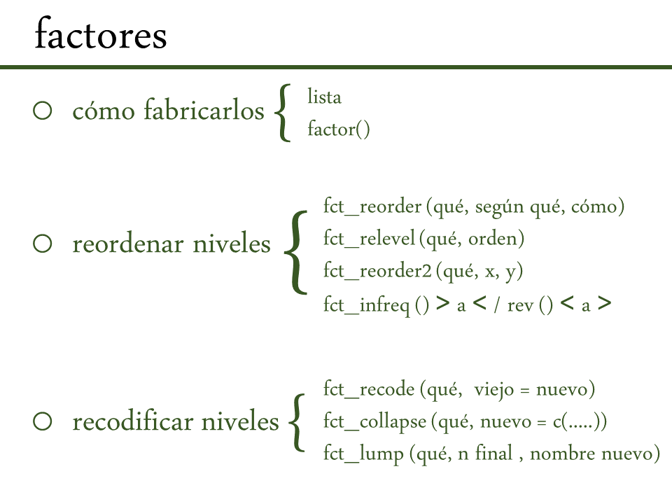

```{r setup, include=FALSE}
knitr::opts_chunk$set(echo = TRUE)
```

¡Factores!

# 1. Cuestiones generales de los factores en R

variables categóricas, es decir, variables que tienen un conjunto fijo y conocido de valores posibles.

Históricamente los factores eran más fáciles de trabajar que los caracteres y entonces TODO se trataba como factor...

`stringsAsFactors = <sigh>`

Pero ya no es así (por suerte). En tidyverse está integrado el paquete `forcats` o *para categorías* 

```{r paquetes, include = FALSE, warning=FALSE, results = 'hide'}
library(tidyverse)
library(datos)
```


Ejemplo
```{r}

x1 <- c("Dic", "Abr", "Ene", "Mar")

```

* Sólo 12 meses posibles pero infinitas formas de llamarlos y de errores de tipeo al escribirlos
* Al ordenar se usa el orden alfabético

Entonces:
1. fabricar una lista con los niveles del factor

```{r}
niveles_meses <- c(
  "Ene", "Feb", "Mar", "Abr", "May", "Jun",
  "Jul", "Ago", "Sep", "Oct", "Nov", "Dic"
)
```

2. fabricar el factor
```{r}
y1 <- factor(x1, levels = niveles_meses)

sort(y1)
```
**Atención** Si omitís el argumento `levels` entonces el orden que toma sí es el alfabético

Si se prefiere que tome el orden de lo primero que aparece en el objeto se le puede pedir eso al fabricar el factor:
```{r}
f1 <- factor(x1, levels = unique(x1))
```
o después:
```{r}
f2 <- x1 %>% factor() %>% fct_inorder()
```


Ventajas
```{r}
x2 <- c("Dic", "Abr", "Eme", "Mar")
y2 <- factor(x2, levels = niveles_meses)
y2 <- parse_factor(x2, levels = niveles_meses)
```

* todo lo que no coincide con el nombre de un nivel pasa a ser NA
* con `parse_factor` se puede analizar dónde están los problemas al fabricar un factor

Y acá la función que sí ya conocemos para acceder a la lista de niveles del factor
```{r}
levels(y1)
```

# 2. Uso de factores en R - datos de la encuesta social general USA - Universidad de Chicago

```{r}
datos::encuesta
```

Ver los niveles en un tibble tiene alguna vuelta, lo mejor es pedir un `count` o graficar
El último argumento impide que se descarten las categorías que tienen recuento = 0.

```{r}
encuesta %>%
  count(estado_civil)

ggplot(encuesta, aes(estado_civil)) +
  geom_bar()+
   scale_x_discrete(drop = FALSE)
```

### Ejercicios

Explora la distribución de ingreso. ¿Qué hace que el gráfico de barras por defecto sea tan difícil de comprender? ¿Cómo podrías mejorarlo?

```{r}
ggplot(encuesta, aes(ingreso)) +
  geom_bar()+
   scale_x_discrete(drop = FALSE)+
  coord_flip()

ggplot(encuesta, aes(ingreso)) +
  geom_bar()+
   scale_x_discrete(drop = FALSE)+
  theme(axis.text.x = element_text(angle = 90, hjust = 1))

```

¿Cuál es la religion más común en esta encuesta? ¿Cuál es el partido más común?
```{r}
ggplot(encuesta, aes(religion)) +
  geom_bar()+
   scale_x_discrete(drop = FALSE)+
  coord_flip()

encuesta%>%
  count(religion) %>%
  arrange(desc(n)) 

ggplot(encuesta, aes(partido)) +
  geom_bar()+
   scale_x_discrete(drop = FALSE)+
  coord_flip()

encuesta%>%
  count(partido) %>%
  arrange(desc(n)) 
```

¿A qué religion se aplica cada denominación? ¿Cómo puedes descubrirlo con una tabla? ¿Cómo lo puedes descubrir con una visualización?

En el tibble se ve que cada religión tiene asociada una denominación religiosa. No estoy segura qué quiere decir esto en los datos particulares, pero desde el punto de vista del ejercicio lo que nos piden es que podamos cruzar la información de la variable categórica "religión" con la variable categórica "denominación de religión" y ver cuántas corresponden más habitualmente a cuales. Si quisiéramos resolverlo por completo deberíamos construir una tabla de contingencia con las frecuencias cruzadas de cada nivel de estas dos categorías. Nos piden que lo resolvamos con tablas y figuras.
```{r}
levels(encuesta$religion)
levels(encuesta$denominacion)
table(encuesta$denominacion,encuesta$religion)

encuesta%>%
  filter(!denominacion %in% c("Sin respuesta","No aplica", "No sabe","Otra", "No denominacional"))%>%
  count(religion)

```

si quisiéramos hacerlo con un gráfico:
```{r}
encuesta %>%
  count(religion, denominacion) %>%
  ggplot(aes(x = religion, y = denominacion, size = n)) +
  geom_point() +
  theme(axis.text.x = element_text(angle = 90))
```

"No denominacional" parecería ser "sin denominación" que es diferente.

# 3. Cambiar orden de los niveles de los factores

Por ejemplo: religión y horas mirando tv

```{r}
resumen_religion <- encuesta %>%
  group_by(religion) %>%
  summarise(
    edad = mean(edad, na.rm = TRUE),
    horas_tv = mean(horas_tv, na.rm = TRUE),
    n = n()
  )

ggplot(resumen_religion, aes(horas_tv, religion)) + geom_point()
```

Lo que queremos lograr es ver los niveles de `religion` ordenados según el valor promedio de horas de tv. Entonces vamos a usar la función `fct_reorder()`
Los argumentos son 

+ `f`, el factor cuyos nivees se quieren reordenar

+ `x`, el vector numérico que se quiere usar como criterio para reordenar los niveles

+ opcionalmente `fun`, cuando hay más de un valor de `x` para cada nivel de `f` es la función para decidir cómo tratar  esos múltiples valores. 

En este caso:
`f` es `religion`
`x` es `horas_tv`
`fun` es `mean` si queremos que sea el promedio (el valor por defecto es `median`, la mediana)

```{r}
ggplot(resumen_religion, aes(horas_tv, fct_reorder(religion, horas_tv, mean))) +
  geom_point()
```

Usar `fct_reorder()` dentro del argumento `aes()` puede no ser buena idea para transformaciones más complejas. Ahí sería mejor modificar lo que sea en un paso previo a hacer el gráfico, usando `mutate()` por ejemplo:
```{r}
resumen_religion %>%
  mutate(religion = fct_reorder(religion, horas_tv,mean)) %>%
  ggplot(aes(horas_tv, religion)) +
  geom_point()
```

Si queremos mover al principio algunos niveles, por ejemplo acá los niveles `No sabe` y `Sin respuesta` podemos usar `fct_relevel()` que tiene como argumentos al factor cuyos niveles se van a modificar, y al listado de niveles que se quieren llevar adelante:
```{r}
resumen_religion %>%
mutate(religion = fct_reorder(religion, horas_tv,mean)) %>%
ggplot(aes(horas_tv,fct_relevel(religion, "Sin respuesta", "No sabe","Ninguna", "Otra"))) +
  geom_point()
```

Esto es para mover al principio, y en el gráfico aparece al final porque para hacerlo se le asigna a esos niveles el valor numérico entero 1. Entonces quedan al principio en el orden de niveles pero van al origen del eje en la figura.

Una yapa: cuando vamos a usar un gráfico que usa color para distinguir niveles de un factor nos puede interesar que los colores de la leyenda coincidan en el espacio cerca de las líneas de ese mismo color, para hacer más fácil la lectura del gráfico. En términos del gráfico queremos que el orden vertical de los niveles como lo vemos en la leyenda coincida con el orden que tienen los valores en el eje y a la derecha del gráfico, es decir, a los valores grandes del eje x. Para eso se usa `fct_reorder2()` y los argumentos que indican el factor sobre el cual queremos reordenar los niveles, la variable del eje x y la variable del eje  y.

```{r}
por_edad <- encuesta %>%
  filter(!is.na(edad)) %>%
  count(edad, estado_civil) %>%
  group_by(edad) %>%
  mutate(prop = n / sum(n))

ggplot(por_edad, aes(edad, prop, colour = estado_civil)) +
  geom_line(na.rm = TRUE)

ggplot(por_edad, aes(edad, prop, colour = fct_reorder2(estado_civil, edad, prop))) +
  geom_line() +
  labs(colour = "estado_civil")
```

Para gráficos de barras se usan dos funciones: `fct_infreq()` para verlos *por frecuencia* (de más a menos frecuencia, orden decreciente, ojo, está mal en la traducción), y `fct_rev()` para verlo al revés (orden creciente de frecuencia)

```{r}
encuesta %>%
  mutate(estado_civil = estado_civil %>% fct_infreq()%>% fct_rev()) %>%
  ggplot(aes(estado_civil)) +
  geom_bar()
```


### Ejercicios

Hay algunos números sospechosamente grandes en `horas_tv`. ¿Es la media un buen resumen?

```{r}
ggplot(encuesta, aes(horas_tv)) +
  geom_bar()

encuesta %>%
  filter(!is.na(horas_tv))%>%
  ggplot(aes(horas_tv)) +
  geom_histogram(binwidth = 1)

```

Identifica para cada factor en `encuesta` si el orden de los niveles es arbitrario o responde a algún principio.
Entonces, vamos a mirar el orden de los niveles en cada factor
```{r}
levels(encuesta$estado_civil)
levels(encuesta$religion)
levels(encuesta$denominacion)
levels(encuesta$partido)
levels(encuesta$ingreso)
```

# 4. Modifical el valor de los niveles de un factor
Algo así como renombrar niveles, recodificar.

La función que se puede usar es `fct_recode()`
Para el caso de los partidos, recodifiquemos para que se pueda leer la descripción que queremos de cada partido
```{r}
encuesta %>% count(partido)

encuesta %>%
  mutate(partido = fct_recode(partido,
    "Republicano duro" = "Fuertemente republicano",
    "Republicano moderado" = "No fuertemente republicano",
    "Independiente pro republicano" = "Ind, pro rep",
    "Independiente pro demócrata" = "Ind, pro dem",
    "Demócrata moderado" = "No fuertemente demócrata",
    "Demócrata duro" = "Fuertemente demócrata"
  )) %>%
  count(partido)
```

+ los niveles que no se mencionan quedan igual
+ los niveles que se asignan al mismo valor pasan a ser un nuevo nivel que unifica varios previos.

Para hacer estotambién se puede usar la función `fct_collapse()` que te permite hacer eso en un solo paso usando un vector de categorías viejas asignado a la nueva:
```{r}
encuesta %>%
  mutate(partido = fct_collapse(partido,
    otro = c("Sin respuesta", "No sabe", "Otro partido"),
    republicano = c("Fuertemente republicano", "No fuertemente republicano"),
    independiente = c("Ind, pro rep", "Independiente", "Ind, pro dem"),
    demócrata = c("No fuertemente demócrata", "Fuertemente demócrata")
  )) %>%
  count(partido)
```

Por último, si queremos agrupar las categorías menos representadas en una sola podemos usar `fct_lump()` con argumentos: el factor sobre el que queremos hacer la agrupación de niveles poco representados, el `n` de categorías totales finales que queremos y el nombre de la categoría que agrupa en `other_level`. Por ejemplo, para el factor `religion` teníamos 16 niveles, queremos quedarnos con los 9 más frecuentes y los demás mandarlos a una categoría amplia que sea "otra":

```{r}
levels(encuesta$religion)

encuesta %>%
  mutate(religion = fct_lump(religion, n = 10, other_level = "Otra")) %>%
  count(religion, sort = TRUE) %>%
  print(n = Inf)
```

### Ejercicios

¿Cómo han cambiado en el tiempo las proporciones de personas que se identifican como demócratas, republicanas e independientes?

```{r}
por_anio <-encuesta %>%
  mutate(partido = fct_collapse(partido,
    otro = c("Sin respuesta", "No sabe", "Otro partido"),
    republicano = c("Fuertemente republicano", "No fuertemente republicano"),
    independiente = c("Ind, pro rep", "Independiente", "Ind, pro dem"),
    demócrata = c("No fuertemente demócrata", "Fuertemente demócrata")
  )) %>%
  count(anio,partido)%>%
  group_by(anio)%>%
  mutate(prop = n / sum(n))

  ggplot(por_anio,aes(x=anio,y=prop,col= fct_reorder2(partido,anio,prop)))+
  geom_line()
  
```

¿Cómo podrías colapsar `ingreso` en un grupo más pequeño de categorías?
```{r}
# primero miro los niveles
levels(encuesta$ingreso)

# y ahora colapso las categorías que quiero simplificar y grafico

encuesta %>%
  mutate(ingreso = fct_collapse(ingreso,
    nsnc = c("Sin respuesta", "No sabe","Se niega a responder","No aplica"),
     mucho = c("15000 - 19999", "20000 - 24999", "25000 o más"),
     maso = c("8000 - 9999", "10000 - 14999"),
    poco = c("7000 - 7999" , "6000 - 6999", "5000 - 5999","4000 - 4999","3000 - 3999", "1000 - 2999","Menos de 1000")
  )) %>%
  ggplot(aes(x = fct_relevel(ingreso,"poco","maso","mucho","nsnc"))) +
  geom_bar()


```
<center>

</center>